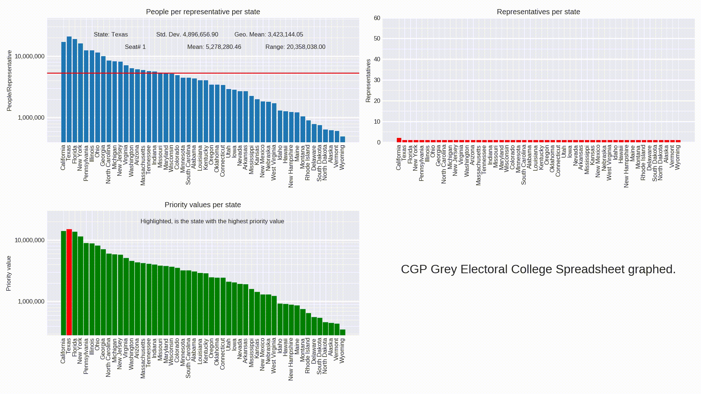

# Electoral College Apportionment

A Matplotlib representation of CGP Grey's Electoral College spreadsheet. This animates
the number of representatives, people to representative ratio, and priority
number calculations.

See [Running](#running) for instructions on how to get started

## Usage

```bash
usage: python3.8 source/bar_chart.py [-h] -f FILE [-d]

Show an animation of the Huntington–Hill apportionment method

optional arguments:
  -h, --help            show this help message and exit
  -f FILE, --file FILE  Path to CSV state population data
  -d, --debug           Show the plot instead of writing to file
```

## Example



## Running

-   Create `conda` env from `environment.yml` (see [Install Conda](https://conda.io/projects/conda/en/latest/user-guide/install/index.html))
-   `requirements.txt` is just for GitHub dependency tracking.
-   From the root of the folder,

```bash
python3.8 ./source/bar_chart.py -f ./data/state-populations.csv
```

-   The resulting video is put into ./recordings
-   If there are any errors, they are most likely backend related.

## Meta

From this [video](https://www.youtube.com/watch?v=6JN4RI7nkes).

Update/Change the state population data by putting your own data into [state-populations.csv](https://github.com/k-donn/ec-apportionment/blob/master/data/state-populations.csv) or pass the new name of the file from the command line.

The CSV file should not have a header.
